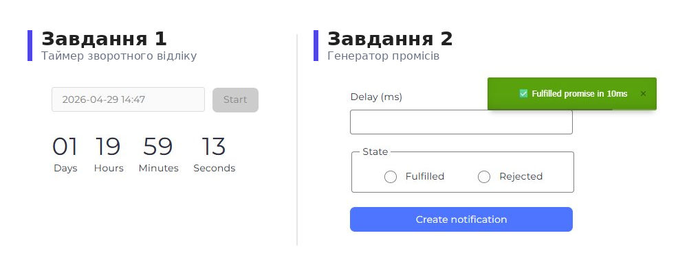

# 🚀 goit-js-hw-10 — Таймер та Генератор промісів


> 🎓 Домашнє завдання №10 курсу **JavaScript** від **GoIT**. Закріплення знань
> про асинхронний код, таймери, інтервали та промісі. ⏳

---

<p align="center">
  
</p>

## 📚 Зміст

- [Про проєкт](#-про-проєкт)
- [Технології](#️-технології)
- [Структура проєкту](#-структура-проєкту)
- [Завдання 1 — Таймер зворотного відліку](#-завдання-1--таймер-зворотного-відліку)
- [Завдання 2 — Генератор промісів](#-завдання-2--генератор-промісів)
- [Встановлення та запуск](#️-встановлення-та-запуск)
- [Автор](#-автор)

---

## 📖 Про проєкт

Цей репозиторій містить **два самостійні завдання**, що демонструють роботу з
асинхронним JavaScript:

1. ⏱️ **Таймер зворотного відліку** до обраної користувачем дати.
2. 🎯 **Генератор промісів** з налаштовуваною затримкою та станом виконання.
   Обидва проєкти зібрані за допомогою **Vite** та використовують популярні
   бібліотеки `flatpickr` і `iziToast` для покращення UX.

---

## 🛠️ Технології

| Технологія               | Призначення                         |
| ------------------------ | ----------------------------------- |
| ⚡ **Vite**              | Збірка та dev-сервер                |
| 📜 **JavaScript (ES6+)** | Основна мова                        |
| 🎨 **HTML5 / CSS3**      | Розмітка та стилізація              |
| 📅 **flatpickr**         | Кросбраузерний date/time picker     |
| 🔔 **iziToast**          | Стилізовані повідомлення-сповіщення |
| ✨ **Prettier**          | Форматування коду                   |

---

## 📁 Структура проєкту

```
goit-js-hw-10/
├── src/
│   ├── js/
│   │   ├── 1-timer.js
│   │   └── 2-snackbar.js
│   ├── css/
│   │   ├── 1-timer.css
│   │   └── 2-snackbar.css
│   ├── 1-timer.html
│   └── 2-snackbar.html
├── package.json
├── vite.config.js
└── README.md
```

---

## ⏰ Завдання 1 — Таймер зворотного відліку

Скрипт, який здійснює зворотний відлік до обраної користувачем дати у форматі
`xx:xx:xx:xx` (дні : години : хвилини : секунди).

### ✨ Функціональність

- 📅 **Вибір дати** через бібліотеку `flatpickr` з підтримкою часу у форматі
  24h.
- ✅ **Валідація**: якщо обрано дату з минулого — кнопка `Start` неактивна,
  з’являється повідомлення `iziToast`: _"Please choose a date in the future"_.
- ▶️ **Запуск таймера** при натисканні `Start`.
- 🔒 Під час відліку інпут і кнопка стають неактивними, щоб користувач не міг
  змінити дату.
- 🔁 Інтерфейс оновлюється **щосекунди**.
- 0️⃣ Числа форматуються з лідуючим нулем (`04` замість `4`) через
  `String.prototype.padStart()`.
- 🛑 Таймер зупиняється при досягненні `00:00:00:00`.

### 📦 Бібліотеки

```js
import flatpickr from 'flatpickr';
import 'flatpickr/dist/flatpickr.min.css';

import iziToast from 'izitoast';
import 'izitoast/dist/css/iziToast.min.css';
```

### 🧮 Допоміжна функція

```js
function convertMs(ms) {
  const second = 1000;
  const minute = second * 60;
  const hour = minute * 60;
  const day = hour * 24;

  const days = Math.floor(ms / day);
  const hours = Math.floor((ms % day) / hour);
  const minutes = Math.floor(((ms % day) % hour) / minute);
  const seconds = Math.floor((((ms % day) % hour) % minute) / second);

  return { days, hours, minutes, seconds };
}
```

---

## 🎯 Завдання 2 — Генератор промісів

Форма, що створює проміс з користувацькою затримкою та обраним станом виконання
(`fulfilled` / `rejected`).

### ✨ Функціональність

- 🕒 Користувач задає **затримку в мілісекундах**.
- 🎚️ Через радіокнопки обирає стан промісу: `Fulfilled` ✅ або `Rejected` ❌.
- 📤 При сабміті форми створюється проміс, який через вказаний час `resolve` або
  `reject` залежно від обраного стану.
- 🔔 Результат відображається як `iziToast`-повідомлення: | Стан | Повідомлення
  | |------|--------------| | ✅ Fulfilled |
  `✅ Fulfilled promise in ${delay}ms` | | ❌ Rejected |
  `❌ Rejected promise in ${delay}ms` |

### 📦 Бібліотеки

```js
import iziToast from 'izitoast';
import 'izitoast/dist/css/iziToast.min.css';
```

---

## ⚙️ Встановлення та запуск

### 1️⃣ Клонувати репозиторій

```bash
git clone https://github.com/mrkorzun/goit-js-hw-10
cd goit-js-hw-10
```

### 2️⃣ Встановити залежності

```bash
npm install
```

### 3️⃣ Запустити dev-сервер

```bash
npm run dev
```

### 4️⃣ Зібрати продакшн-версію

```bash
npm run build
```

### 5️⃣ Деплой на GitHub Pages

```bash
npm run deploy
```

---

## 🌐 Демо

- 🔗 **GitHub Pages:** [`https://mrkorzun.github.io/goit-js-hw-10/`](#)
- 📂 **Вихідний код:** [`https://github.com/mrkorzun/goit-js-hw-10`](#)

---

## 👨‍💻 Автор

Розроблено в рамках навчального курсу **GoIT — Front-End / Full Stack
JavaScript**.

> 💡 _«Три чверті курсу JavaScript пройдено! 💪»_
